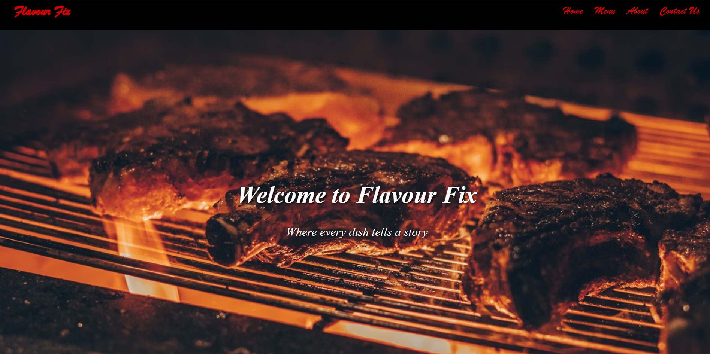
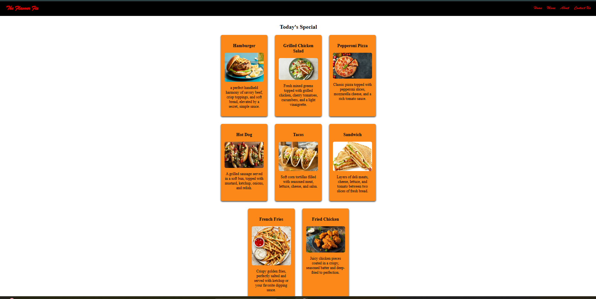
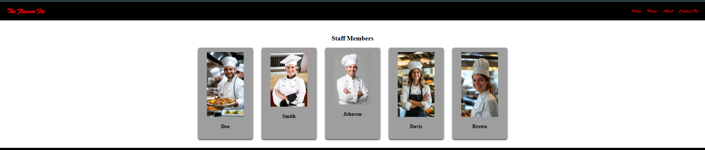
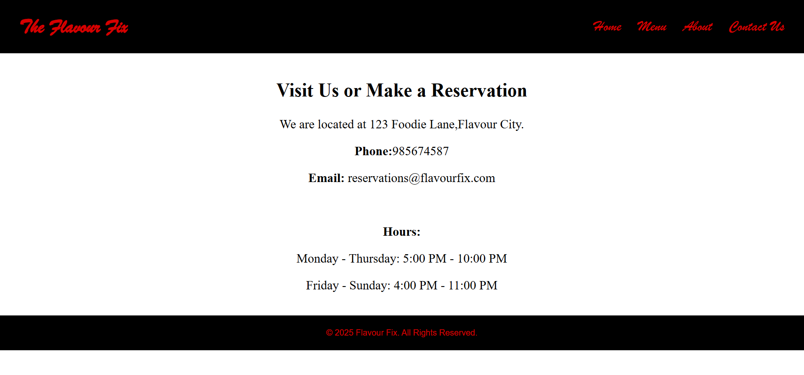

# Ex.06 Restaurant Website
## Date: 26.12.2025

## AIM:
To develop a static Restaurant website to display the food items and services provided by them.

## DESIGN STEPS:

### Step 1:
Requirement collection.

### Step 2:
Creating the layout using HTML and CSS.

### Step 3:
Updating the sample content.

### Step 4:
Choose the appropriate style and color scheme.

### Step 5:
Validate the layout in various browsers.

### Step 6:
Validate the HTML code.

### Step 7:
Publish the website in the given URL.

## PROGRAM:
```
home.html

<!DOCTYPE html>
<html lang="en">
<head>
    <meta charset="UTF-8">
    <meta name="viewport" content="width=device-width, initial-scale=1.0">
    <title>Flavour Fix</title>
    <link rel="stylesheet" href="style.css">
</head>
<body>
    <header>
        <h1>Flavour Fix</h1>
        <nav>
            <ul>
                <li><a href="home.html">Home</a></li>
                <li><a href="menu.html">Menu</a></li>
                <li><a href="about.html">About</a></li>
                <li><a href="contact.html">Contact Us</a></li>
            </ul>
        </nav>
    </header>
    <section id="home" class="home">      
        <h1>Welcome to Flavour Fix</h1>
        <p>Where every dish tells a story</p>
    </section>
     <section id="story"class="story">
            <h2>Our Story</h2>
            <p>
               Flavour Fix is not just a place to eat; it is a conceptual experience built on the philosophy that mastery of flavor's foundation (Salt) must precede the thrill of its extreme sensation (Spice). Chef Elias Thorne’s goal is to prove that spice shouldn't mask poor seasoning but should elevate perfect seasoning.
            </p>
        </section>
    <footer>
        <p>&copy; 2025 Flavour Fix. All Rights Reserved.</p>
    </footer>
</body>
</html>

menu.html

<!DOCTYPE html>
<html lang="en">
<head>
    <meta charset="UTF-8">
    <meta name="viewport" content="width=device-width, initial-scale=1.0">
    <title>Menu</title>
    <link rel="stylesheet" href="style.css">
</head>
<body>
    <header>
    <h1>The Flavour Fix</h1>
        <nav>
            <ul>
                <li><a href="home.html">Home</a></li>
                <li><a href="menu.html">Menu</a></li>
                <li><a href="about.html">About</a></li>
                <li><a href="contact.html">Contact Us</a></li>
            </ul>
        </nav>
    </header>
    <section id="menu" class="story">
        <h2>Today's Special</h2>
        <div class="menu">
            <div class="items">
                <h3>Hamburger</h3>
                
                <p>a perfect handheld harmony of savory beef, crisp toppings, and soft bread, elevated by a secret, simple sauce.</p>
            </div>
            <div class="items">
                <h3>Grilled Chicken Salad</h3>
                
                <p>Fresh mixed greens topped with grilled chicken, cherry tomatoes, cucumbers, and a light vinaigrette.</p>
            </div>
            <div class="items">
                <h3>Pepperoni Pizza</h3>
                
                <p>Classic pizza topped with pepperoni slices, mozzarella cheese, and a rich tomato sauce.</p>
            </div>
            <div class="items">
                <h3>Hot Dog</h3>
                
                <p>A grilled sausage served in a soft bun, topped with mustard, ketchup, onions, and relish.</p>
            </div>
            <div class="items">
                <h3>Tacos</h3>
                
                <p>Soft corn tortillas filled with seasoned meat, lettuce, cheese, and salsa.</p>
            </div>
            <div class="items">
                <h3>Sandwich</h3>
                
                <p>Layers of deli meats, cheese, lettuce, and tomato between two slices of fresh bread.</p>
            </div>
            <div class="items">
                <h3>French Fries</h3>
                
                <p>Crispy golden fries, perfectly salted and served with ketchup or your favorite dipping sauce.</p>
            </div>
            <div class="items">
                <h3>Fried Chicken</h3>
                
                <p>Juicy chicken pieces coated in a crispy, seasoned batter and deep-fried to perfection.</p>
            </div>
        </div>
    </section>
    <footer>
        <p>&copy; 2025 The Flavour Fix. All Rights Reserved.</p>
    </footer>
</body>
</html>

about.html

<!DOCTYPE html>
<html lang="en">
<head>
    <meta charset="UTF-8">
    <meta name="viewport" content="width=device-width, initial-scale=1.0">
    <title>About Us - The Flavour Fix</title>
    <link rel="stylesheet" href="style.css">
</head>
<body>
    <header>
       <h1>The Flavour Fix</h1>
        <nav>
            <ul>
                <li><a href="home.html">Home</a></li>
                <li><a href="menu.html">Menu</a></li>
                <li><a href="about.html">About</a></li>
                <li><a href="contact.html">Contact Us</a></li>
            </ul>
        </nav>
    </header>
    <section id="about">
        <h2>Staff Members</h2>
        <div class="menu">
            <div class="staff">
                
                <h3>Doe</h3>
            </div>
            <div class="staff">
                
                <h3>Smith</h3>
            </div>
            <div class="staff">
                
                <h3>Johnson</h3>
            </div>
            <div class="staff">
                            
                 <h3>Davis</h3>
                </div>
            <div class="staff">
               
                 <h3>Brown</h3>
            </div>
        </div>
    </section>
    <footer>
        <p>&copy; 2025 The Flavour Fix. All Rights Reserved.</p>
    </footer>
</body>
</html>

contact.html

<!DOCTYPE html>
<html lang="en">
<head>
    <meta charset="UTF-8">
    <meta name="viewport" content="width=device-width, initial-scale=1.0">
    <title>Contact Us</title>
    <link rel="stylesheet" href="style.css">
</head>
<body>
     <header>
        <h1>The Flavour Fix</h1>
        <nav>
            <ul>
                <li><a href="home.html">Home</a></li>
                <li><a href="menu.html">Menu</a></li>
                <li><a href="about.html">About</a></li>
                <li><a href="contact.html">Contact Us</a></li>
            </ul>
        </nav>
    </header>
    <section id="contact" class="story">
             <h2>Visit Us or Make a Reservation</h2>
            <p>We are located at 123 Foodie Lane,Flavour City.</p>
            <p><strong>Phone:</strong>985674587</p>
            <p><strong>Email:</strong> reservations@flavourfix.com</p>
            <br>
            <p><strong>Hours:</strong></p>
            <p>Monday - Thursday: 5:00 PM - 10:00 PM</p>
            <p>Friday - Sunday: 4:00 PM - 11:00 PM</p>
    </section>
    <footer>
        <p>&copy; 2025 Flavour Fix. All Rights Reserved.</p>
    </footer>
</body>
</html>

style.css

body{
            font-family: 'Roboto', sans-serif;
            margin: 0;
            padding: 0;
            background-color: #ffffff;
            color: #000000;
        }
        header{
            background-color: #000000;
            color: #d60000;
            font-family: 'brush script mt', cursive;
            font-size: 1.2em;
            padding: 0.1em 2em;
            display: flex;
            position: sticky;
            justify-content: space-between;
            align-items: center;     
        }
        nav ul{
            list-style: none;
            margin: 0;
            padding: 0;
            display: flex;
            gap: 2rem;
        }
        nav a{
            color: #d60000;
            text-decoration: none;
            font-size: 1.5em;
        }
        .home{
            background: url('https://images.unsplash.com/photo-1558030137-d464dd688b00?q=80&w=1331&auto=format&fit=crop&ixlib=rb-4.1.0&ixid=M3wxMjA3fDB8MHxwaG90by1wYWdlfHx8fGVufDB8fHx8fA%3D%3D') center/cover no-repeat;
            height: 100vh;
            padding: 0.1em 0em;
            text-align: center;
            align-content: center;
            color:#ffffff;
            font-size: 2em;
            font-family:'Playfair Display', serif;
            font-style:italic;
            text-shadow: 2px 2px 6px #000;
        }
        section{
            text-align: center;
            font-size: 1.5em;
            font-family: 'Playfair Display', serif;
            font-style: bold;
            padding: 2em;
        }
        .menu {
            display: flex;
            justify-content: center;
            flex-wrap: wrap;
            gap: 2em;
        }
        .items {
            background-color: #fb8818;
            border-radius: 10px;
            box-shadow: 0 4px 8px rgba(0, 0, 0, 0.815);
            padding: 1em;
            width: 250px;
        }
        .items img{
            width: 100%;
            border-radius: 10px;
        }
        .story{
        max-width: 1200px;
        margin: 0 auto;
        padding: 20px;
        }
        .staff{
            background-color: #9f9e9e;
            border-radius: 10px;
            box-shadow: 0 4px 8px rgba(0, 0, 0, 0.815);
            padding: 1em;
            width: 250px;
        }
        footer {
        background-color: #000000;
        color: #d60000;
        text-align: center;
        padding: 0.5em;
        }
```

## OUTPUT:




## RESULT:
The program for designing software company website using HTML and CSS is completed successfully.
